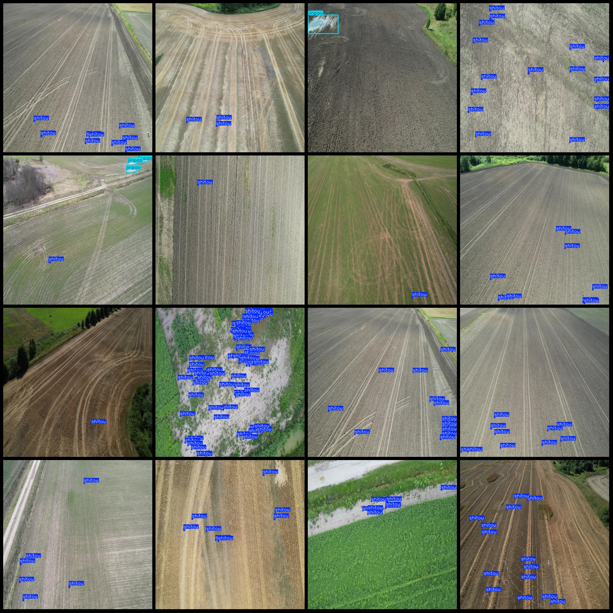
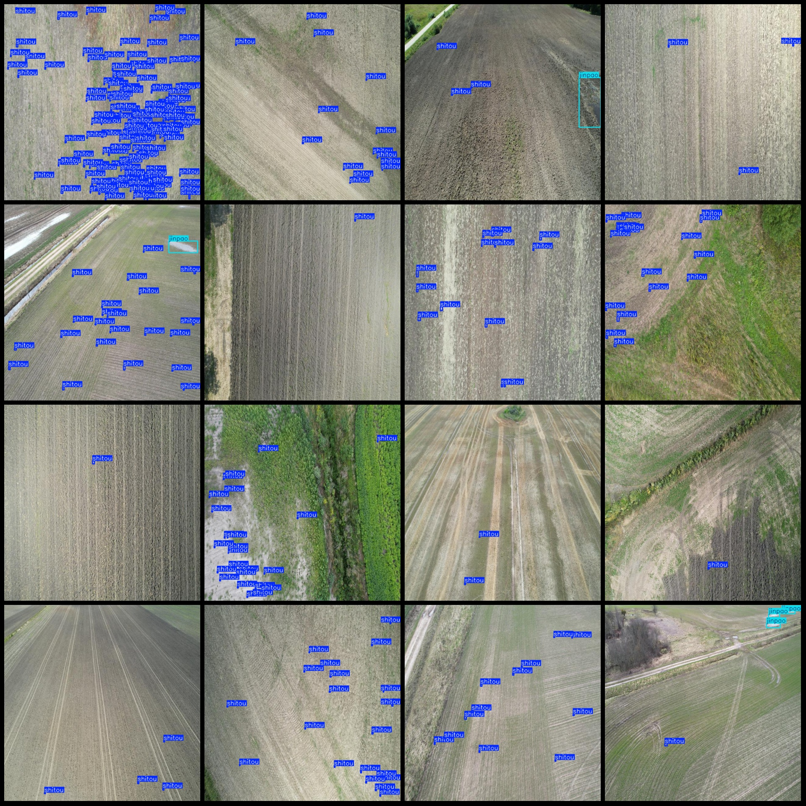

# Drone Perspective Cropland Soil Immersion Area and Obstacle Detection Dataset in Pascal VOC+YOLO Format with 1060 Images, 2 Categories

Dataset format: Pascal VOC format + YOLO format (without split path's txt file, only including jpg images as well as corresponding VOC format xml files and YOLO format txt files).
Number of images (jpg file count): 1060.
Number of annotations (xml file count): 1060.
Number of annotations (txt file count): 1060.
Number of categories: 2.
Annotation category names (note that the order of categories in the YOLO format does not correspond to this, but according to the labels folder "classes.txt"): ["jinpao", "shitou"].
Number of bounding boxes per category:
- Jinpao (immersion) = 233
- Shitou (stone) = 13709
Total bounding boxes: 13942.
Number of images per category:
- Jinpao = 124
- Shitou = 1013
Image resolution: 640x640.
Annotation tool used: labelImg.
Annotation rules: draw a square box around the category.
Drone: DJI MAVIC 3.
Collecting height: 20-50m.
Collecting angle: 60-90°.
Special note: The dataset does not have a training/validation/test split; you need to divide it yourself.
Special declaration: This dataset does not guarantee the accuracy of the trained model or the weight files.
Image preview:
Annotation example:

## Images

Here is a pay link on Stripe ( https://buy.stripe.com/3cs8yP7sY87d0vu9AB ). Please contact me lonlonago@foxmail.com after funding $89, and I will send you a complete data files , thank you!

